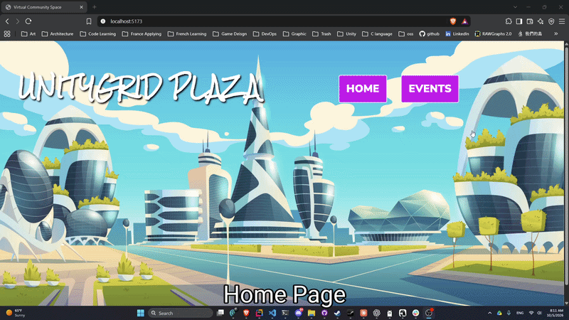
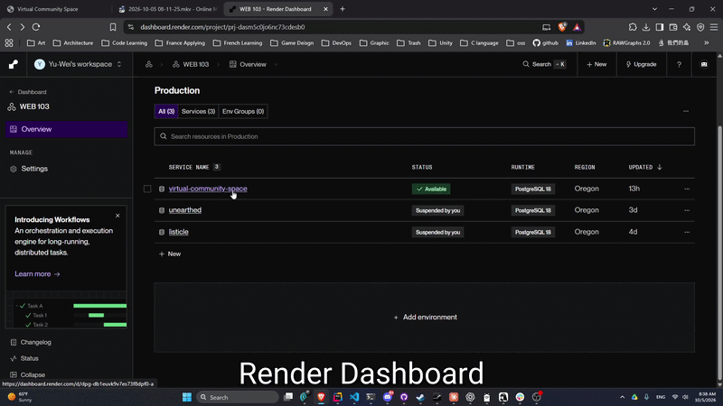

# WEB103 Project 3 - *UnityGrid Plaza*

Submitted by: **Yu-Wei Tseng**

About this web app: **UnityGrid Plaza is a virtual community space for discovering music events across four Dallas-area venues. Users can explore an interactive map to select a location and view its upcoming (and past) events, or browse all events on a dedicated Events page with location filtering and date sorting. Each event displays a live countdown timer.**

Time spent: **10** hours

## Required Features

The following **required** functionality is completed:

<!-- Make sure to check off completed functionality below -->

- [x] **The web app uses React to display data from the API**
- [x] **The web app is connected to a PostgreSQL database, with an appropriately structured Events table**
  - [x]  **NOTE: Your walkthrough added to the README must include a view of your Render dashboard demonstrating that your Postgres database is available**
  - [x]  **NOTE: Your walkthrough added to the README must include a demonstration of your table contents. Use the psql command 'SELECT * FROM tablename;' to display your table contents.**
- [x] **The web app displays a title.**
- [x] **Website includes a visual interface that allows users to select a location they would like to view.**
  - [x] *Note: A non-visual list of links to different locations is insufficient.* 
- [x] **Each location has a detail page with its own unique URL.**
- [x] **Clicking on a location navigates to its corresponding detail page and displays list of all events from the `events` table associated with that location.**

The following **optional** features are implemented:

- [x] An additional page shows all possible events
  - [x] Users can sort *or* filter events by location.
- [x] Events display a countdown showing the time remaining before that event
  - [x] Events appear with different formatting when the event has passed (ex. negative time, indication the event has passed, crossed out, etc.).

The following **additional** features are implemented:

- [x] Interactive SVG map on the home page with hover effects revealing venue names
- [x] Live countdown timer that updates every 60 seconds
- [x] Date sorting (earliest/latest first) on the Events page

## Video Walkthrough

Here's a walkthrough of implemented required features:

Here's a walkthrough of the Render dashboard and database contents:

## Notes

Challenges encountered:
- Race condition in database seeding — `forEach` with callback-based queries didn't await inserts, causing foreign key violations. Fixed by switching to `for...of` with `await`.
- Several external image URLs became unavailable over time, requiring replacements with stable CDN sources.
- Route parameter mismatch between Express route definitions (`:id`) and controller reads (`req.params.locationId`) caused silent failures.

## License

Copyright 2026 Yu-Wei Tseng

Licensed under the Apache License, Version 2.0 (the "License"); you may not use this file except in compliance with the License. You may obtain a copy of the License at

> http://www.apache.org/licenses/LICENSE-2.0

Unless required by applicable law or agreed to in writing, software distributed under the License is distributed on an "AS IS" BASIS, WITHOUT WARRANTIES OR CONDITIONS OF ANY KIND, either express or implied. See the License for the specific language governing permissions and limitations under the License.